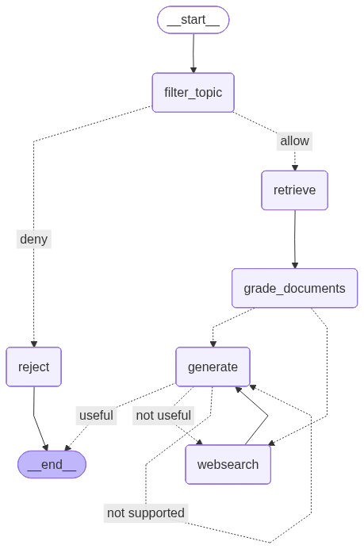

# RespectHer: Agentic RAG Chatbot on Online Gender-based Violence against Women and Girls

Agentic RAG chatbot application that addresses question and provides information on online gender-based violence against women ang girls.

Author: Ariana Britez

## Overview

This repository contains the code that supports the Streamlit chatbot application **RespectHer**, an agentic Retrival-Augmented Generation (RAG) app built with:
- LangGraph
- LangChain
- OpenAI
- Tavily Web Search
- Streamlit

This app answers questions about online gender-based violence against women and girls (OGBV) using:
- Question topic relevance grading
- Vector database
- Web search fallback
- Hallucination grading
- Answer relevance grading

## Live App

**Try it here**: [RespectHer Chatbot](https://agentic-rag-ogbv.streamlit.app) (no setup required)


## Features

* Topic Filtering: Rejects questions that are outside the project scope.
* Retrieval: Searches a vector store of curated documents.
* Document Relevance Grading: Filters out irrelevant retrieved documents.
* Web Search Fallback: If vector results are insufficient, the app runs a Tavily web search.
* Self-Reflective Generation: The system 
checks hallucinations, 
verifies if the answer addresses the question, 
retries generation if necessary, 
and stops safely after a bounded number of attempts.
* Source Attribution: All AI generated answers include source URLs extracted from document metadata.

## Architecture

 Graph architecture


## Tech Stack

* Frontend: Streamlit
* LLM: OpenAI GPT-4o-mini
* Framework: LangChain and LangGraph
* Web Search: Tavily
* Vector Store: Pinecone

## Data Resources

- [UN Women Articles](https://www.unwomen.org/en/articles/)
- [UN Women News](https://www.unwomen.org/en/news-stories/)
- [Report](https://www.unwomen.org/sites/default/files/2025-06/normative-advances-on-technology-facilitated-violence-against-women-and-girls-en.pdf): Normative Advances on Technology-Facilitated Violence Against Women and Girls (UN Women, 2025)
- [Paper](https://www.isdglobal.org/wp-content/uploads/2023/09/Misogynistic-Pathways-to-Radicalisation-Recommended-Measures-for-Platforms-to-Assess-and-Mitigate-Online-Gender-Based-Violence.pdf): Misogynistic Pathways to Radicalisation (Bundtzen, 2023)
- Web search by [Taviliy](https://www.tavily.com)

## Run Locally

1. Clone this git repository and start a new environment

2. Install dependencies with `uv sync`

3. Create an `.env` file with the following API keys:
- OPENAI_API_KEY=your_openai_api_key
- TAVILY_API_KEY=your_tavily_api_key
- PINECONE_API_KEY=your_pinecone_api_key
- LANGSMITH_TRACING=true and LANGSMITH_PROJECT=your_project_name if tracing with LangSmith (optional)

4. Run app with `streamlit run main.py`

## Example Questions

- How is AI amplifying violence against women and girls?
- What global and regional normatives have been implemented to fight online violence against women and girls?
- What is the manosphere and what terms are related to it?
- What forms of online violence are women facing online in 2026?

## Project Structure 
```
.
├── README.md
├── backend.py
├── graph
│   ├── __init__.py
│   ├── chains
│   │   ├── __init__.py
│   │   ├── answer_grader.py
│   │   ├── generation.py
│   │   ├── hallucination_grader.py
│   │   ├── retrieval_grader.py
│   │   ├── router.py
│   │   ├── tests
│   │   │   ├── __init__.py
│   │   │   └── test_chains.py
│   │   └── topic_grader.py
│   ├── consts.py
│   ├── graph.py
│   ├── nodes
│   │   ├── __init__.py
│   │   ├── filter_topic.py
│   │   ├── generate.py
│   │   ├── grade_documents.py
│   │   ├── reject.py
│   │   ├── retrieve.py
│   │   └── web_search.py
│   └── state.py
├── graph.png
├── ingestion.py
├── main.py
├── pyproject.toml
└── uv.lock
```

